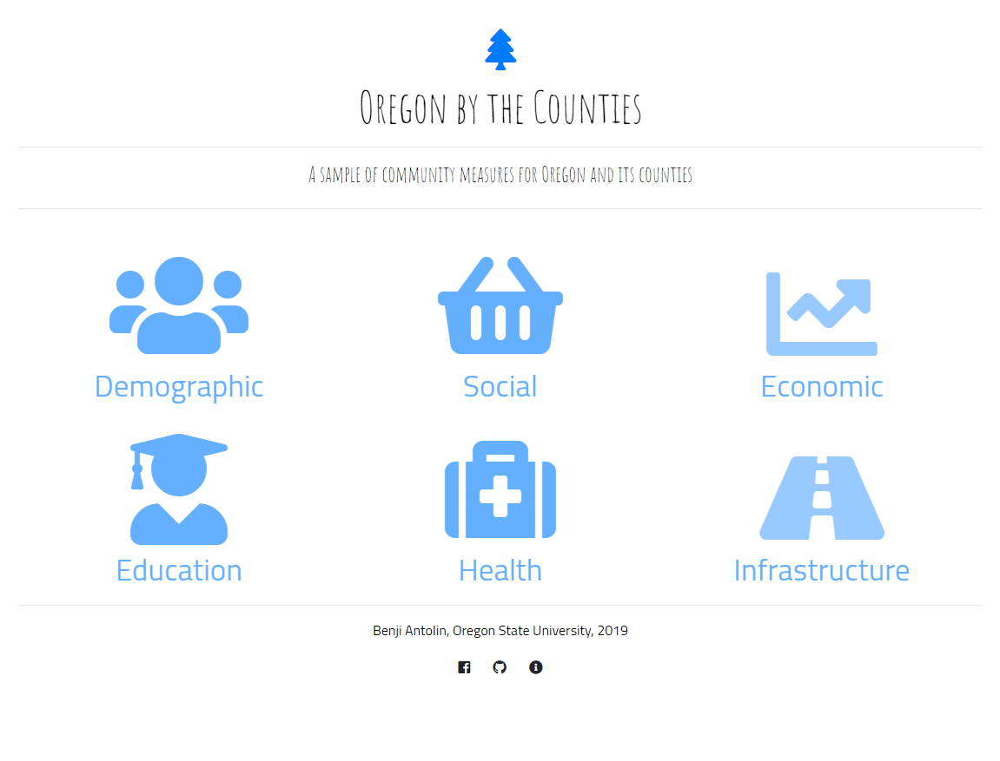

# Oregon by the Counties

[Click here for story map dashboard](https://benjiantolin.github.io/oregon_keymeasures_dashboard/index.html)

### Introduction
This is a dashboard of story maps that contains a sample of key measures from the [Oregon by the Numbers 2018 Edition](https://www.tfff.org/select-books/book/oregon-numbers) report.

The sample of key measures topics are as follows:

- Demographic
- Social
- Economic
- Education
- Health
- Infrastructure

This dashboard includes just a handful of the key measures provided by Oregon by the Numbers to further visualize the data using a dynamic online interface. The goal of Oregon by the Numbers is to get information to local community leaders and engaged citizens to encorage data driven decision making and data literacy.

This Oregon by the Counties story map further extends the vision by creating an online interactive platform to visualize and analyze the key measures for Oregon counties.

#### Preview
- The structure of the dashboard comprises of 6 html pages each devoted to a key measure topic as outlined above. The index page acts as the home page for the dashboard and is used to navigate from topic to topic

- Each topic hosts a sample of key measures delivered via story map presentation through the use of a series of choropleths to spatially visualize the given measure.

### Libraries
- leaflet.js
- jquery.js
- popper.js
- bootstrap.js
- chroma.js
- globalminimap.js
- storymap.2.5.js

#### Sources
- **Data and Content:** [Oregon by the Numbers](https://www.tfff.org/select-books/book/oregon-numbers)
- **Video:** [Morissey Productions](https://www.youtube.com/watch?v=V2vwFS8ae2I&t=2s)
- **Favicon:** [Wikipedia](https://www.wikipedia.org/)
- **Spatial Data:** [Oregon Explorer](https://oregonexplorer.info/)

#### Acknowledgement
Thank you to Professor Bo Zhao of Oregon State University for the guidance throughout this project.
